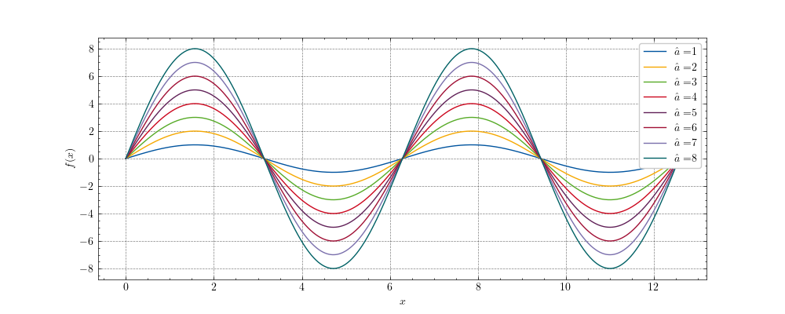

# RWTH Aachen University - Corporate Design Colors

This repository contains RWTH Aachen University's corporate design color definitions in different formats.
See [here](https://www9.rwth-aachen.de/global/show_document.asp?id=aaaaaaaaaadpbhq) for oringinal color defintions (German only)

## Android Studio
An XML file containing most RWTH colors

## CSS
.css file containing all RWTH Colors

## LaTeX
.tex file containing all RWTH Colors for use with the xcolor package

## Draw.io
A json file containing all RWTH Colors for use with draw.io

## Python Package
To integrate RWTH's colors into your python application, you can use the rwthcolors package

### Installation

You can install rwthcolors via pip:

`pip install rwthcolors`

### Usage

Simply import RWTHColors via :
`import RWTHColors`

Then you can use:
`plt.style.use('rwth')` to get RWTH colors in your matplotlib plots. Theres also style available called `rwth-full` containing a color cyle with more colors.
There als a style called `rwth-dark` that is intended to be used with dark backgrounds. E.g. using `with plt.style.context(['dark_background', 'rwth-dark']):..`
If you want to access colors explictly you can also use

`from RWTHColors import ColorManager`

and then instantiate a ColorManager using:

`cm = ColorManager()`

and then for example: `c=cm.RWTHSchwarz.p(75)` to get RWTH black as 75 % version.
The method by default returns the HEX code of the color. If you need RGB codes, you can instantiate
a ColorManager using  ColorManager(frmt='RGB').

If instantiated, the ColorManager furthermore replaces matplotlibs default color cycle with the same cycle used in mplstlye `rwth`.

## Color Palette
`cm.plot_color_palette()` returns a figure showing all RWTH colors


## Tip
You can get even more beautiful plots if you use rwthcolors together with the [SciencePlots](https://github.com/garrettj403/SciencePlots) python package.
Then you can use for example:

`with plt.style.context(['science', 'grid', 'rwth']):
	...
`

or another example:

```
import matplotlib.pyplot as plt
import numpy as np
import RWTHColors
import scienceplots

plt.style.use(['science', 'grid', 'rwth'])

x = np.arange(0, 4*np.pi, .01)

fig, ax = plt.subplots(1, 1, figsize=(10, 4))

for a in [1,2,3,4,5,6,7,8]:
    ax.plot(x, a*np.sin(x), label='$\hat{a}=$' + '${}$'.format(a))
    
ax.legend(loc=1)
ax.set_xlabel('$x$')
ax.set_ylabel('$f(x)$')

plt.show()

```

which produces:



<!-- CONTACT -->
# Disclaimer

This repository is not maintened by RWTH Aachen University's marketing department but a voluntary offer by the Institute of Rail Vehicles and Transport Systems.
If you have the color definitions in other formats, feel free to contribute them using a merge request.

<div>  
<a href="">
    
  </a>
</div>
